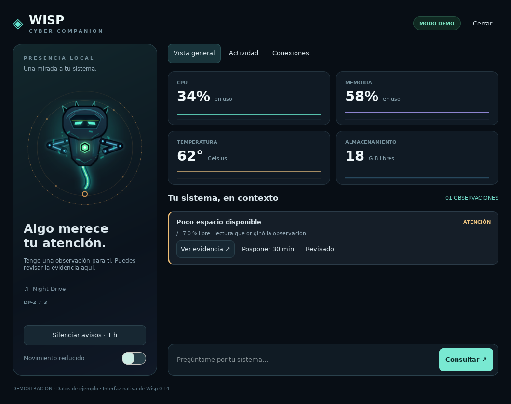

# Cyber Companion

Cyber Companion is a metamorphic, holographic entity that reacts to the state
of a Gentoo Linux + Hyprland desktop.

## Wisp Desktop v0.14

A native GTK4 companion console with a separate local daemon, live Linux
observations, temporal alerts, evidence-based explanations, durable preferences,
a private control API and optional local Ollama inference. The Wayland avatar
supports click, menu, drag, monitor selection and reduced motion.



```bash
python3 scripts/desktop-doctor.py
python3 scripts/build-wisp-v2.py --atlas-only --jobs 2
scripts/run-desktop.sh
```

Read the [desktop setup and usage guide (Español)](docs/DESKTOP_V014.md) for
dependencies, launchers, Hyprland integration, local AI and verification limits.
The service runs independently of the interface and every model provider.
This release does not perform OS mutations or connect to a ChatGPT account.

### Architecture and implementation

The [v0.14 implementation status](docs/platform/IMPLEMENTATION_V014.md) maps the
running components to the [platform architecture](docs/platform/README.md).
The [v0.13.1 review](docs/platform/REVIEW_2026-09-07.md) records the preceding
contract audit; v0.14 corrects those validation gaps and adds the first runtime
and desktop slice. Historical architecture documents describe the remaining
target, including capabilities and provider extensions.

The implementation is on `codex/wisp-desktop-v0.14`, stacked on the architecture
PR #5. It is a reviewable source release; it has not been installed on your
Gentoo/Hyprland host. See the guide for the outstanding host acceptance checks.

## Wisp Visual v0.12

Visual v0.12 is a graphics-only upgrade built on the stable v0.11 behavior
contract. It replaces the default three-raster acceptance rig with a
deterministic character compositor rendered at four times the target
resolution and downsampled into the same seven-row Wayland V-Pets atlas.

The avatar now has faceted armor, controlled holographic bloom, a breathing
core, visor micro-expression, shoulder and elbow articulation, an energy tail,
media-specific violet accents, and a separate upright system-processing visual
language. See [Wisp Visual v0.12](docs/VISUAL_V2.md). Run the visual builder to
produce the animated review, canonical still and multi-background contact
sheet locally.

## Manifestations

- **Core** — minimal presence for normal system activity.
- **Wisp** — everyday desktop companion.
- **Sentinel** — direct interaction and important events.
- **Guardian** — rare, full-system manifestation.
- **Swarm** — transition between manifestations.

These are forms of the same distributed consciousness, not separate
characters.

## Current status

The project is completing foundation/compatibility validation and has a proposed
functional-platform architecture.

- [x] Original visual concept
- [x] Event-driven architecture vertical slice
- [x] Gentoo/Hyprland installation plan
- [x] Safe Wayland V-Pets configuration without keyboard capture
- [x] Wisp Rig v1 and renderer alpha correction
- [x] Native MPRIS and Linux system-presence states
- [x] Declarative priority-based behavior director
- [x] Wisp Visual v0.12 deterministic high-resolution renderer
- [x] Platform Architecture v0.13 design, security boundary, ADRs and roadmap
- [x] Initial Event v2 envelope/compatibility code in draft PR #4 (not wired into runtime)
- [x] v0.13.1 runtime/desktop review and native interaction design
- [ ] Close strict validation gaps and the existing stale sprite-test expectation
- [ ] Accept Visual v0.12 on the target Gentoo desktop and both wallpapers
- [ ] Implement Core v2 event/state/persistence/supervision foundation
- [ ] Add typed system awareness, insights, attention and textual output
- [ ] Add safe queries, capabilities, policy, approvals and audit
- [ ] Add optional local AI explanation provider
- [ ] Add optional OpenAI and MCP adapters
- [ ] Deliver native panel and evaluate interactive layer-shell renderer during A2

## Design principles

- Useful without AI or Internet.
- Wayland- and Hyprland-aware.
- No global keyboard capture by default.
- Facts, state, insights, plans, actions and presentations are separate.
- No adapter or AI provider can execute side effects directly.
- Renderers, model providers and capabilities are replaceable.
- Local-first privacy and no silent cloud fallback.
- Minimal runtime dependencies and no systemd requirement.
- Configuration and generated state remain in XDG user directories.
- Typed contracts, explicit schema migration and deterministic replay.
- System changes are narrow, approved, auditable and reversible when possible.
- Visual output is deterministic and mechanically testable.

## Repository layout

```text
assets/            Character concepts and manifests
config/            Example renderer and behavior configuration
cyber_companion/   Current event, state, behavior and renderer-command core
docs/              Architecture, platform, visual and Gentoo installation notes
renderer/          Patches for the pinned Wayland renderer
scripts/           Build, validation, diagnostics and runtime helpers
tests/             Python and isolated renderer contract tests
```

Start with [the Gentoo installation guide](docs/GENTOO_INSTALL.md). Do not add
your user to the `input` group for this project.

## Build the active avatar

Pillow is required only to generate the visual assets. The runtime consumes the
resulting PNG exactly as before.

```bash
python3 scripts/build-wisp-v2.py

python3 scripts/validate-sprite.py \
  assets/sprites/companion-wisp-system-v0.12.png \
  assets/source/wisp/manifest-system-v0.12.json

python3 -m unittest discover -s tests
./scripts/test-renderer-alpha.sh
./scripts/test-renderer-media.sh
```

The compiler creates a 6144×1344 RGBA atlas containing seven 24-frame states,
an animated review GIF, a transparent still and a multi-background contact
sheet. These outputs are ignored because the procedural model and manifest are
the reproducible source of truth. Rig v1 remains available as a fallback and
renderer regression fixture.

## Upstream renderer candidate

The current adapter uses [Wayland V-Pets](https://github.com/furudbat/wayland-vpets),
an MIT-licensed Wayland overlay that documents Hyprland, multi-monitor support
and runtime custom PNG sprite sheets. Cyber Companion does not vendor or
redistribute the upstream project. The reproducible build applies four narrow
local patches recorded in `UPSTREAM.lock`.

Architecture v0.13 keeps it as the ambient renderer while adding independent
textual/control outputs. A future renderer can replace it without changing
system observation, policy, AI or actions.

Build the pinned renderer with the active visual atlas:

```bash
./scripts/build-renderer.sh
```

## Live system connection

The current compatibility controller listens to every MPRIS-compatible media
source and Linux system telemetry, emits normalized events and switches Wayland
V-Pets between calm, media and system-presence states through native renderer
signals.

```bash
CYBER_COMPANION_MONITOR=<monitor-name> ./scripts/run-system.sh
```

## Versioning note

- `v0.11` identifies the current behavior core.
- `Visual v0.12` identifies the active graphics asset and build pipeline.
- `Architecture v0.13` identifies the proposed functional platform contracts
  and roadmap; it contains no runtime implementation yet.

These versions are intentionally separate so visual, behavioral and platform
changes can evolve without unnecessary coupling.

## Licensing

No project license has been selected yet. Unless a license is added, the code,
documentation and original artwork remain under the repository owner's
copyright.
