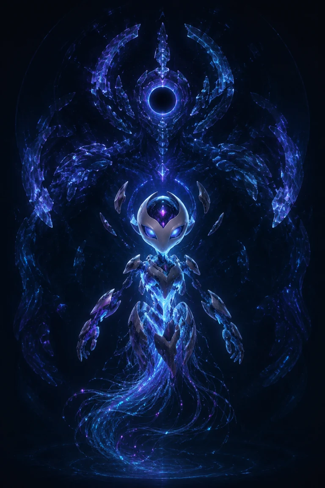

# Cyber Companion

Cyber Companion is the visual personification of **VegetaLinux**: a metamorphic,
holographic entity that reacts to the state of a Gentoo Linux + Hyprland system.

The project starts as a lightweight desktop companion and is intentionally
designed to evolve into a visible interface for a local or remote AI system.



## Manifestations

- **Core** — minimal presence for normal system activity.
- **Wisp** — everyday desktop companion.
- **Sentinel** — direct interaction and important events.
- **Guardian** — rare, full-system manifestation.
- **Swarm** — transition between manifestations.

These are forms of the same distributed consciousness, not separate characters.

## Current status

The project is in **Phase 0: foundation and compatibility validation**.

- [x] Original visual concept
- [x] Event-driven architecture
- [x] Gentoo/Hyprland installation plan
- [x] Safe Wayland V-Pets configuration without keyboard capture
- [x] Validate Wayland V-Pets on the target system
- [x] Define the Wisp v1 production sprite contract
- [x] Produce a deterministic six-frame Wisp idle preview
- [ ] Produce the first Wisp sprite sheet
- [ ] Add MPRIS music reactions
- [ ] Add libvirt, network, idle and thermal adapters
- [ ] Add an AI adapter

## Design principles

- Wayland- and Hyprland-aware.
- No global keyboard capture by default.
- Events are independent from avatar rendering.
- Renderers and avatars are replaceable.
- Minimal dependencies and no systemd requirement.
- Configuration and generated state remain in XDG user directories.
- System changes must be reversible.

## Repository layout

```text
assets/          Character concepts, source manifests and generated atlases
config/          Example renderer configuration
docs/            Architecture and Gentoo installation notes
scripts/         Diagnostics, validation and future runtime helpers
```

Start with [the Gentoo installation guide](docs/GENTOO_INSTALL.md). Do not add
your user to the `input` group for this project.

Avatar production follows [the Wisp sprite specification](docs/SPRITE_SPEC.md).
The default configuration now runs the v0.4 idle-only acceptance preview. It
keeps the avatar fixed in world space and disables system reactions until the
remaining transition rows exist. The v0.3 atlas remains only as a rejected
visual prototype.

Rebuild and validate the preview with:

```bash
./scripts/build-idle-preview.sh
python3 scripts/validate-sprite.py \
  assets/sprites/companion-wisp-idle-v0.4.png \
  assets/source/wisp/manifest-idle-v0.4.json
```

## Upstream renderer candidate

Phase 0 evaluates [Wayland V-Pets](https://github.com/furudbat/wayland-vpets),
an MIT-licensed Wayland overlay that explicitly documents Hyprland,
multi-monitor support and runtime custom PNG sprite sheets. Cyber Companion does
not vendor or redistribute the upstream project.

The renderer remains an adapter, not the core architecture. If it cannot expose
the state control needed for music and future integrations, it can be replaced
without redesigning the character or event model.

## Licensing

No project license has been selected yet. Unless a license is added, the code,
documentation and original artwork remain under the repository owner's
copyright.
