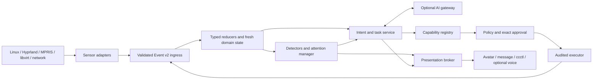

# Architecture

Cyber Companion is evolving from a desktop-avatar vertical slice into a
local-first system companion platform.

The currently implemented v0.11 behavior core remains:

```text
system adapters -> synchronous event bus -> mutable domain snapshot
                -> declarative behavior director
                -> one presentation command
                -> Wayland V-Pets signal adapter
```

This is a valid compatibility architecture for Wisp Visual v0.12. It correctly
keeps MPRIS/Linux observation separate from behavior selection and keeps
renderer signals out of adapters. Its current limitations are documented in
[the v0.13 architecture review](platform/ARCHITECTURE_REVIEW.md).

The proposed implementation target is defined by the
[Platform Architecture v0.13 package](platform/README.md).

## Target architecture



The implementation style is a local modular monolith. One daemon owns event
ordering, state, policy and audit. The renderer, local model server and selected
plugins may remain supervised external processes. This avoids distributed-system
complexity while retaining explicit ports and replaceable adapters.

## Architectural invariants

1. Monitoring and critical alerts work with AI disabled.
2. Adapters publish facts; they do not choose animations, messages or actions.
3. Typed reducers are the only authority for current observed state.
4. AI output is untrusted and can explain or propose, never grant permission or
   execute directly.
5. Every side effect passes through capability registry, deterministic policy,
   exact approval when required, executor and audit.
6. Wayland V-Pets is an ambient renderer, not the application shell.
7. Textual channels exist for critical information and approvals.
8. No private context leaves the machine without explicit egress policy.
9. Every queue is bounded; slow/failing components are isolated.
10. Contracts and persisted schemas are independently versioned and replayable.

## Current event contract

The implemented v1 event is intentionally small:

```json
{
  "version": 1,
  "source": "mpris",
  "type": "media.playing",
  "timestamp": "2026-08-25T12:00:00-06:00",
  "data": {
    "title": "Example track",
    "artist": "Example artist"
  }
}
```

Core v2 will add identity, schema, subject, ordering, causality, privacy,
freshness and retention while preserving a compatibility mapper for built-in
v1 adapters. See [Events, State and Attention](platform/EVENTS_STATE_AND_ATTENTION.md).

## Current behavior contract

`config/behaviors.json` remains the current compatibility policy. It selects one
renderer-neutral command using deterministic priority and stable name ordering:

```json
{
  "version": 1,
  "profile": "media",
  "behavior": "music_sway",
  "intensity": 0.65,
  "transition": "smooth"
}
```

The target design keeps deterministic presentation policy but introduces
separate detectors, insight lifecycle and attention management. Not every fact
should become an avatar state, and not every important insight should interrupt
the user.

## Capability and action boundary

Cyber Companion distinguishes:

- sensors: continuous read-only observations;
- queries: bounded on-demand read-only inspection;
- actions: operations with side effects.

There is no default generic shell capability. Models and integrations see only
versioned capability descriptors and may propose plans. Only the executor can
invoke action implementations after policy and approval. See
[Capabilities, Actions and Security](platform/CAPABILITIES_SECURITY_AND_ACTIONS.md).

## Optional AI

AI providers sit outside the critical event path. The companion owns context,
conversation and memory. A local Ollama or llama.cpp server and an optional
OpenAI Responses provider implement the same internal provider port.

The first AI use is read-only explanation over verified, bounded context. Tool
and action-plan proposal support is added only after the capability/policy
boundary and model evaluation harness exist. See [AI and MCP](platform/AI_AND_MCP.md).

## MCP

MCP is used at the interoperability edge to import allowlisted external tools or
export selected companion resources. It is not the internal event bus, plugin
supervisor, state model or permission system. Imported tools receive the same
local risk, policy, approval and audit treatment as native capabilities.

## Presentation

The target presentation broker supports independent channels:

```text
ambient avatar | textual message/notification | ccctl/control UI | optional voice
```

Wayland V-Pets remains the initial ambient adapter and consumes semantic states.
A future custom layer-shell renderer may add bubbles and direct interaction
without changing domain or action code.

## Runtime locations

```text
$XDG_CONFIG_HOME/cyber-companion/   User configuration, no secrets
$XDG_STATE_HOME/cyber-companion/    SQLite state, retained events and audit
$XDG_RUNTIME_DIR/cyber-companion/   Owner-only control socket and transient files
$XDG_DATA_HOME/cyber-companion/     Installed assets and external renderer source
```

No component requires root in the planned initial generations. Secrets are
resolved through a secret-provider port and never committed to configuration or
stored in event payloads.

## Migration

This is not a big-bang rewrite. The delivery sequence is:

1. Event v2, bounded async backbone, SQLite and supervisor under compatibility
   adapters;
2. typed domains, new system adapters, insights, attention and textual output;
3. local IPC, read-only capabilities, policy, plans, approval and audit;
4. local AI explanation only;
5. optional plan proposals, OpenAI provider and MCP;
6. richer interaction and renderer evolution.

The complete acceptance gates are in the [functional roadmap](platform/ROADMAP.md).

## Decision records

- [ADR-0001: local modular monolith](adr/0001-modular-monolith.md)
- [ADR-0002: AI is an optional adviser](adr/0002-ai-is-an-optional-adviser.md)
- [ADR-0003: MCP is an interoperability boundary](adr/0003-mcp-is-an-interoperability-boundary.md)
- [ADR-0004: Wayland V-Pets is an ambient renderer](adr/0004-wayland-vpets-is-an-ambient-renderer.md)

## Security baseline

The current version does not read `/dev/input/event*`, join the `input` group,
capture screen contents or listen to the microphone. Future microphone, screen,
remote access or privileged capabilities require separate opt-in adapters,
threat models and ADRs. None is implied by adding AI.
