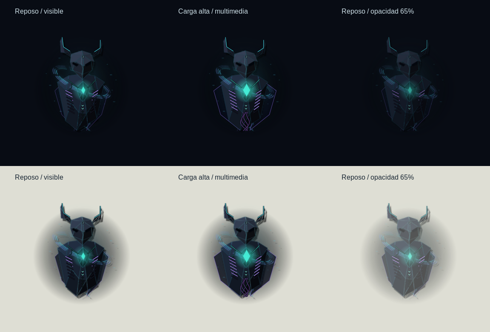

# Wisp · Live desktop integration

The native avatar is a horned spectral character: an elongated hollow mask,
an illuminated core and a fractured mantle give it recognizable anatomy without
mechanical limbs. `scripts/wisp_v2/anatomy.py` projects depth-sorted 3D facets
with directional lighting into the deterministic sprite atlas. Fine filaments
and an oblique orbit preserve its holographic character. The procedural
compositor is `scripts/wisp_v2/entity.py`; the previous robot renderer remains
in `character.py` as historical source. The seven-row atlas contract and paths
remain compatible.

The live Cairo layer maps **fresh** system observations to anatomy:

| Part | System relationship |
| --- | --- |
| Core and branching vessels | CPU controls glow, pulse speed and core size; unknown data does not pulse |
| Core color | Amber when the reported temperature is within 7 °C of its sensor limit |
| Mantle | Memory use illuminates seven tapered gill slits on each side and expands the outer folds |
| Horns | Cyan for a local route, amber for no route, dim for unknown |
| Violet filaments | Active media playback, not a measured audio spectrum |
| Overall size | Smoothly scales from 90% to at most 113% based on load and hover |

The input surface stays 384×336, so drag targets do not jump when the character
grows. Pointer movement adds subtle eased parallax. Reduced
motion fixes the scale at 96% and disables pulse and parallax, while readings
and colors still update. The tooltip explains the anatomy map.

Directional facets, an offset silhouette shadow, a soft darkness field and a
projected floor shadow give it volume. Dark text outlines and emissive rims
improve legibility on light and dark backgrounds. This is **contrast treatment,
not background sampling**: Wisp does not capture the screen or infer wallpaper
colors. The character is a projected sprite with live accents, not a full 3D
scene or physically simulated lighting.

Idle motion now uses a slower 2.64-second cycle, with shorter cycles for media
and processing. Transition rows keep their original timing and exact endpoint
contracts. The desktop surface is 384×336 logical pixels (20% larger), with
additional anatomical scaling. CPU vessels branch from the heart across the chest,
and memory lights tapered gill slits cut into the existing mantle facets. These
marks follow the sprite mesh's yaw and perspective. Horn ridges show the local
route. A small forehead glyph replaces the workspace label across the mask;
six vertebrae in the lower central seam light for running VMs, saturating at six.
Named workspaces are abbreviated to three characters on the mask. Exact workspace
names, CPU/memory percentages and VM counts remain in the tooltip and panel.
The CPU/RAM plates, percentage text, network label, VM label and media bars are
removed. Active media flows through violet filaments instead. All accents share
the character's scale and parallax. Amber indicates attention; an amber heart
also indicates temperature within 7 °C of the reported sensor limit.



After 2.5 seconds without interaction, the avatar eases toward 65% opacity.
Hover restores visibility promptly; dragging, an open menu or the companion
panel keeps it visible. The generous character input region stays stable at all
opacities. Reduced motion uses immediate opacity changes and freezes decorative
motion. Ambient rendering still falls to 8 fps after fading; interactive updates use
the frame clock. System alerts continue through the existing notification path.

Automatic monitor placement now chooses an output **without focus**. With two
screens, Wisp moves to the other one as focus changes. With three or more, it
keeps its current screen while that screen remains inactive. A single screen
remains usable; missing focus keeps the current connected screen, and unplugging
an output falls back to another available screen. Explicit monitor selection and
a manual drag still pin the character; choose **Automático · pantalla sin foco**
to resume dynamic placement. Fullscreen on the active screen does not hide Wisp
on the other screen. Session lock and disconnected-service hiding still apply.

During a drag, the original input surface stays mapped and stationary, preserving
Wayland's implicit pointer grab. Input-transparent preview surfaces follow the
pointer on each output, including the seam between screens. Movement is coalesced
once per frame without positional easing. On release, the original surface moves
to the pointer's output, clamps to reachable bounds, and saves the monitor and
margins in one request. Old status replies cannot undo a pending drop. Margins
use logical coordinates, support negative/stacked output layouts, and allow up
to 32768 pixels for large desktops. Source and previews do not reserve desktop
space and ignore panel-exclusive zones so margin coordinates match monitor bounds.

This follows [Wayland's implicit-grab model](https://wayland.freedesktop.org/docs/book/Protocol.html)
and [GDK's logical monitor geometry](https://docs.gtk.org/gdk4/method.Monitor.get_geometry.html).
Keeping the grabbed surface on its original monitor avoids
[layer-shell remapping during a gesture](https://wmww.github.io/gtk4-layer-shell/gtk4-layer-shell-GTK4-Layer-Shell.html#gtk-layer-set-monitor).

Network state refers to a local default route, not verified Internet access.
Workspace and running-VM indicators use the daemon's existing adapters. Missing
or expired data is shown as unknown. Reduced motion freezes the decorative
effects; fresh readouts still update. Drag position is no longer reset by a
status poll while the gesture is active.

## Desktop setup

```bash
python3 scripts/desktop-doctor.py
python3 scripts/build-wisp-v2.py --atlas-only --jobs 2
python3 scripts/install-desktop.py --hyprland
hyprctl reload
~/.local/bin/wisp --avatar-only
```

The optional `--hyprland` flag installs a managed `wisp.conf` include beside
`hyprland.conf`. It starts the avatar once at login and binds **Super+Alt+W** to
open the panel. Before the first edit it preserves `hyprland.conf.before-wisp`.
Repeating installation does not duplicate the include or replace the backup.
An existing unmanaged `wisp.conf` is rejected. Check that Super+Alt+W is free in
your own configuration before opting in. The default installer still changes
only user launchers and the application-menu entry.

The launcher points at the checkout; keep that directory or reinstall after
moving it. There is no system service, root requirement or cloud connection.
Remove the managed source line to disable session integration; removing it
does not stop a running avatar. Right-click the avatar to exit its interface;
`ccctl stop` stops the monitoring daemon.

For this host, `~/.config/cyber-companion/desktop.json` includes `/`, `/home`,
`/data` and `/vm`, and enables the read-only libvirt adapter. These paths and
preferences are host configuration, not new defaults for everyone.

## Validation on Gentoo / Hyprland

```bash
python3 -m unittest discover -s tests -v
python3 scripts/smoke-desktop.py
python3 scripts/smoke-ui.py
python3 scripts/smoke-avatar.py
```

The GTK smoke tests use separate application IDs. `smoke-avatar.py` briefly
creates a clearly labeled demo avatar on a real layer-shell compositor. It
checks geometry, no reserved desktop area, no keyboard grab, click/menu handlers,
drag persistence, monitor assignment and visibility for fullscreen, locked,
unknown-session and disconnected states. It uses synthetic snapshots for these
transitions: it does not actually lock the desktop, force a window fullscreen,
or change daemon preferences. Physical gesture/compositor behavior remains a
separate acceptance check.

Host acceptance on 2026-09-10: the native avatar rendered on DP-2, all seven
configured adapters reported healthy, and the real `/home` low-space condition
produced an amber warning. Both connected monitors were exercised by the
Wayland test; fractional scaling and suspend/resume were not exercised.
An eight-second sample of the earlier instrumented avatar measured about 19% of one CPU core and 257 MiB
RSS for the GTK client, and 6% of one core / 32 MiB RSS for the daemon. This is
a short live-session sample, not a sustained idle benchmark or a performance
guarantee, and it has not been repeated for the anatomical renderer. No
provider/model inference was tested. The anatomical revision passed 60 unit
tests, atlas validation, GTK and real Wayland smoke checks. All seven host feeds
remained healthy after its interface restart.

## Interaction revision validation · 2026-09-12

The revised GTK panel and real Wayland avatar smoke checks passed on the two
connected 1920×1080 outputs. The avatar gate exercises stationary input geometry,
preview creation, cross-output placement, drop persistence, stale-poll protection,
cancellation, opacity, menu interaction, lock/fullscreen visibility and reconnect.
The geometry/visibility unit tests additionally cover negative and stacked
layouts, ultrawide bounds, opacity recovery and reduced motion. The full suite
passed 65 tests. Rendering was inspected on light and dark backgrounds.

These gesture handlers are exercised with synthetic coordinates; a physical
mouse drag and mixed-DPI compositor behavior still need hands-on acceptance.


## Inactive-screen and living-skin revision · 2026-09-12

The full suite passed 68 tests. The daemon lifecycle, GTK panel and real Wayland
avatar smoke checks passed. Automatic placement was exercised against both real
outputs with a synthetic focus change and fullscreen state; unit cases cover
three screens, an unplugged preferred output, missing focus and one/no outputs.
The existing drag, stale-poll, lock, reconnect and reduced-motion gates still pass.
The 65% ambient floor retains the 8 fps idle rendering budget. The preview above
was rendered from the live Cairo compositor at desktop size on light and dark
backgrounds, with low load, high load/media and idle opacity.
