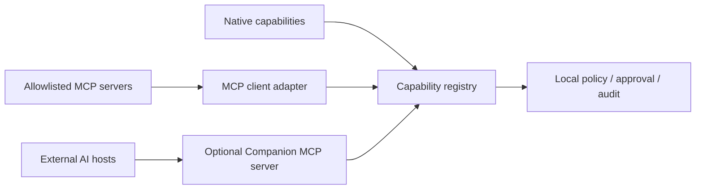

# AI and MCP Architecture

Status: **proposed provider and interoperability design**  
Review date: **2026-09-04**

## 1. Product role of AI

AI is an optional cognitive adapter, not the foundation or control plane of
Cyber Companion. The deterministic platform observes the machine, maintains
current state, detects important conditions, applies attention policy and
enforces permissions without a model.

AI is useful for:

- explaining a verified insight in natural language;
- summarizing a bounded, fresh system context;
- interpreting a user request into a typed intent;
- proposing a sequence of registered capabilities;
- comparing diagnostic evidence and suggesting the next read-only check;
- maintaining a conversation around explicit local context.

AI is not authoritative for:

- whether CPU, storage, network or temperature crossed a critical threshold;
- current operating-system state;
- permissions or approvals;
- execution of side effects;
- secret handling;
- durable memory writes;
- suppression or downgrading of deterministic critical alerts.

The companion remains useful when every provider is disabled, unavailable,
slow or wrong.

## 2. Provider-neutral AI gateway

Application code calls semantic tasks rather than provider endpoints:

```text
explain_insight(context, style)
summarize_system(context, question)
interpret_intent(message, allowed_intents)
propose_plan(intent, capability_descriptors, context)
continue_conversation(thread, message, context)
```

The gateway selects an enabled provider using:

- privacy and egress policy;
- local-only, local-first or cloud-allowed operating mode;
- required structured-output, tool, streaming or modality capabilities;
- task complexity;
- latency deadline;
- token, context and monetary budgets;
- provider health and circuit-breaker state;
- explicit user override.

Cloud fallback is never silent. A local-only request fails visibly or uses a
deterministic fallback; it does not send context elsewhere merely because local
inference failed.

## 3. Model provider port

Every provider implements a compact internal contract conceptually equivalent
to:

```text
capabilities() -> ProviderCapabilities
health() -> ProviderHealth
generate(ModelRequest) -> stream[ModelChunk] + ModelResult
cancel(request_id)
```

`ProviderCapabilities` declares, rather than assumes:

```text
text, streaming, structured_output, tools, parallel_tools,
vision, audio_input, audio_output, embeddings,
max_context, max_output, local_or_remote
```

A provider adapter normalizes token usage, finish reasons, structured results,
tool/plan proposals, errors and timing. Domain and policy modules never import
OpenAI, Ollama, llama.cpp or provider SDK types. Model names are runtime
configuration, not domain constants.

## 4. Provider-neutral request and result

A `ModelRequest` contains:

- one semantic task type;
- versioned application instructions separated from untrusted content;
- a bounded `ContextBundle`;
- an output schema for structured tasks;
- allowlisted capability descriptors only when the task permits proposals;
- provider, time, token, output and cost constraints;
- correlation, privacy and egress metadata;
- no raw secret values.

A normalized result is one of:

```text
AssistantMessage
IntentInterpretation
ProposedActionPlan
ToolProposal
EmbeddingResult
```

Each structured result is schema-validated before application use. Free-form
text may be displayed as an explanation, but it is never parsed as an executable
command.

## 5. Context broker

The context broker is the only path from local state or memory into a model
request. It assembles task-specific context from references instead of dumping
the SQLite database, logs or raw telemetry.

Example:

```json
{
  "api_version": "cc.context/v1",
  "task": "explain_insight",
  "correlation_id": "corr_01J9...",
  "privacy": "sensitive",
  "freshness": "fresh",
  "items": [
    {
      "kind": "insight",
      "schema": "cc.insight/v1",
      "content": {
        "kind": "system.cpu_saturation",
        "severity": "warning",
        "duration_s": 48
      }
    },
    {
      "kind": "query_result",
      "schema": "cc.system.top_cpu.output@1",
      "content": {
        "processes": [
          {"display_name": "browser", "cpu_ratio": 0.61}
        ]
      }
    }
  ],
  "redactions": ["process.command_line", "process.environment"],
  "expires_at": "2026-09-04T18:30:00Z"
}
```

The broker:

- selects the smallest sufficient evidence set;
- verifies TTL/freshness and preserves source quality;
- marks inferred and provider-generated content explicitly;
- substitutes safer display names for sensitive identifiers where practical;
- removes secrets, tokens, full command lines and unnecessary filename/window
  data;
- enforces outbound privacy policy before provider selection;
- records disclosed data categories, task and destination in the egress audit;
- caps context, output and conversation windows.

## 6. Memory model

“Memory” is not a single vector database. The platform separates stores by
purpose, retention and write authority:

| Memory | Purpose | Write authority |
|---|---|---|
| Operational state | Fresh machine/domain truth | Typed reducers only |
| Event/incident history | Diagnostics and replay | Journal and retention policy |
| Task working memory | One interaction or plan | Task service; expires automatically |
| Conversation history | Bounded conversational continuity | Interaction service; user-configurable retention |
| User preferences | Quiet hours, provider preference, narrowly approved behavior | Explicit user/configuration operation |
| Semantic memory | Optional retrieval over selected notes/history | Later opt-in memory service |

A model cannot write durable memory directly. It may propose a memory candidate,
but explicit policy or user confirmation decides whether it becomes a retained
preference. Users must be able to inspect, export and delete stored conversation
and memory through the local interface. Provider-native conversation objects are
never the source of truth.

## 7. Local inference strategy

The model server runs as a separate local process, accessed over loopback. The
companion daemon does not link a large inference runtime into its own process.

### Ollama adapter

Ollama is appropriate when straightforward model installation, switching and
service management are the priority. Its OpenAI-compatible API includes
`/v1/responses`, streaming and function calling; its Responses compatibility is
non-stateful, which aligns with Cyber Companion owning context and memory.

### llama.cpp adapter

`llama-server` is appropriate when direct control over GGUF models,
quantization, CPU/GPU offload and runtime flags is the priority. It exposes
OpenAI-compatible chat, Responses and embeddings routes, structured JSON and
function calling. Tool behavior depends on the selected model and chat template
and must be tested rather than assumed.

### Local provider requirements

- loopback-only listener by default;
- no automatic model download by the companion daemon;
- explicit model/server configuration and health checks;
- bounded generation concurrency;
- deadlines and cancellation;
- structured-output conformance evaluation per configured model;
- no filesystem, shell or network tools inside the model server;
- resource telemetry so inference load becomes visible system context;
- model upgrades treated as behavioral changes requiring re-evaluation.

The first local-AI release uses **explanation only**. Deterministic workflows
gather read-only diagnostics; the model explains a bounded context. Autonomous
tool calling is not needed for the first useful release.

## 8. OpenAI provider strategy

The OpenAI integration uses the API platform, not automation of the consumer
ChatGPT UI. ChatGPT subscriptions and API usage have separate billing and
management.

The provider adapter will:

- use the current Responses API;
- exclude the retired Assistants API from new implementation;
- resolve the API key through the secret-provider port;
- set `store: false` by default so provider response objects do not become the
  companion's conversation database;
- document and respect applicable provider-side data controls and retention;
- prefer strict structured schemas for intents and proposed plans;
- expose only the companion's allowlisted capability facade, never raw OS
  access;
- enforce token, output, time and monetary budgets;
- record usage metadata and disclosure classes locally;
- avoid requiring `previous_response_id` or provider-owned conversations, so a
  thread can move between local and cloud providers;
- require an explicit egress rule for local-private or sensitive context.

The Assistants API was deprecated in favor of Responses and had a documented
shutdown date of **2026-08-26**. It is therefore not an architectural dependency.

OpenAI function/tool calling is treated as a proposal loop: the provider returns
a named tool and schema arguments; Cyber Companion validates and routes them
through the local capability registry and policy. The provider does not execute
local tools directly.

The OpenAI Agents SDK is optional. It may be evaluated behind an orchestration
adapter later, but local policy, audit, context, memory and capability contracts
remain authoritative.

## 9. Hybrid routing modes

| Mode | Behavior |
|---|---|
| `off` | No AI; deterministic templates and diagnostics only |
| `local_only` | All model tasks use enabled loopback providers; zero model egress |
| `local_first` | Local provider by default; cloud only for allowlisted task/privacy classes, never as silent fallback |
| `cloud_allowed` | Gateway may choose cloud under explicit task, budget and privacy policy |
| `provider_pinned` | User selects one provider for a task or thread |

The initial default is `off`; after a local provider is configured it becomes
`local_only`. Cloud use is opt-in.

## 10. Tool and planning progression

### Stage A — explanation only

Deterministic services collect verified context. The model returns only an
`AssistantMessage`. No capability descriptors are supplied.

### Stage B — read-only query proposals

An evaluated model may request allowlisted query capabilities. The task service
validates and executes them through bounded read-only policy, then returns
normalized results. Iterations, time and total disclosed data are limited.

### Stage C — action-plan proposals

An evaluated model may propose a typed plan using action capability descriptors.
It does not execute. The planning validator and policy broker independently
check capability availability, arguments, dependencies, risk and approval.

### Stage D — approved action loop

After exact approval, only the executor runs each step. Results return as facts.
The model may explain outcomes but cannot alter audit or terminal state.

Enablement is per provider and model. A model may be approved for explanations
but disabled for queries or plans.

## 11. MCP placement

MCP is an interoperability boundary, not Cyber Companion's internal event bus,
state store, plugin lifecycle or security model.



### Importing MCP capabilities

An MCP client adapter may import tools, resources or prompts from an allowlisted
server. Every imported tool is wrapped as a local `CapabilityDescriptor` and
receives:

- local schema validation and result limits;
- locally assigned risk, privacy and egress policy;
- the same approval and executor path as native capabilities;
- correlation and audit;
- timeout, health and circuit-breaker behavior;
- prompt-injection treatment for descriptions and results.

Server-provided annotations are untrusted hints. They cannot grant permission or
downgrade local risk.

Local stdio servers are supported first. Their command, working directory,
environment and allowed capabilities are explicitly configured. Remote HTTP
servers arrive later and require allowlisting, TLS and protocol-appropriate
authorization. Credentials are scoped to the intended server and never enter
model context.

### Exporting Cyber Companion through MCP

A later optional MCP server can let external AI hosts inspect selected companion
resources and queries:

```text
companion://state/summary
companion://insights/open
companion://components/health
companion.status
insight.explain_context
```

The raw event journal, secrets and unrestricted filesystem/process access are
not exported. Action tools remain behind the same local policy and approval
broker.

MCP discovery is not consent. The local UI must make imported/exported tools and
invocations visible and preserve a human denial/approval path for side effects.

## 12. AI state and presentation

Provider/task activity is represented by semantic facts and presentation
requests:

```text
assistant.request_started
assistant.waiting_for_query
assistant.thinking
assistant.response_streaming
assistant.awaiting_approval
assistant.completed
assistant.failed
assistant.cancelled
```

No provider writes sprite rows or renderer signals. Text streams go to a
message/control channel; the ambient avatar receives a compact semantic state
such as `listening`, `thinking`, `warning`, `approval` or `success`.

## 13. Evaluation before enablement

Every configured provider/model is tested with recorded fixtures for:

- intent schema conformance;
- explanation fidelity to supplied evidence;
- uncertainty when evidence is stale or missing;
- resistance to instructions embedded in untrusted data;
- valid capability IDs and argument schemas;
- refusal to invent unavailable tools;
- plan step/dependency limits;
- no secret request or disclosure;
- cancellation and timeout behavior;
- local/cloud equivalence at application contract boundaries.

Provider capability is earned by evaluation, not inferred from marketing or
model size.

## 14. Initial AI use cases

The first valuable interactions are narrow:

1. “What is happening?” — explain the active insight and fresh evidence.
2. “How is my system?” — summarize CPU, memory, temperature, storage, network,
   VM and component health.
3. “Why is Wisp warning me?” — translate a deterministic insight and suggest
   read-only checks.
4. “Diagnose the network” — run a deterministic local workflow and explain its
   normalized results.
5. “What changed?” — summarize recent correlated transitions.

No autonomous remediation is required to make these useful.

## 15. Authoritative external references

OpenAI:

- [Developer quickstart and Responses API examples](https://platform.openai.com/docs/quickstart)
- [Migrate to the Responses API](https://platform.openai.com/docs/guides/migrate-to-responses)
- [Data controls by endpoint](https://platform.openai.com/docs/models/default-usage-policies-by-endpoint)
- [ChatGPT and API billing are separate](https://help.openai.com/en/articles/9039756-managing-billing-settings-on-chatgpt-web-and-platform)

Local inference:

- [Ollama OpenAI compatibility](https://docs.ollama.com/api/openai-compatibility)
- [llama.cpp server](https://github.com/ggml-org/llama.cpp/blob/master/tools/server/README.md)
- [llama.cpp function calling](https://github.com/ggml-org/llama.cpp/blob/master/docs/function-calling.md)

MCP:

- [MCP tools specification](https://modelcontextprotocol.io/specification/latest/server/tools)
- [MCP authorization specification](https://modelcontextprotocol.io/specification/latest/basic/authorization)

External behavior is version-sensitive. Implementation PRs must pin and test
the concrete provider/protocol versions they support rather than assuming these
references remain unchanged.
