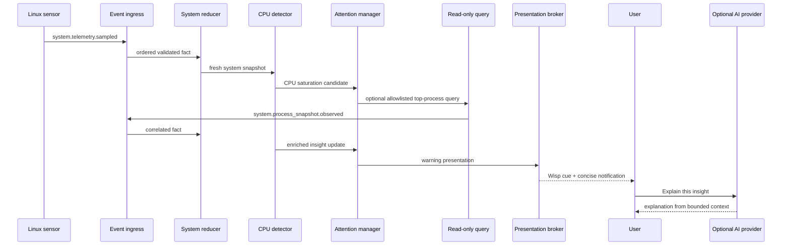

# Events, State and Attention

Status: **proposed contract for Core v2**

## 1. Separate facts, commands and presentations

The current project uses normalized events correctly, but future implementation
must make the semantic distinction explicit:

- **Event:** an immutable fact that already happened.
- **Command:** a request for one component to do something.
- **Intent:** a user or system goal that may require planning.
- **Insight:** a conclusion supported by current evidence and suitable for
  attention management.
- **Action plan:** a proposed sequence of typed capability calls.
- **Presentation request:** a semantic request to communicate, not an OS action.
- **Action result:** an event produced after an attempted side effect.

Events are never disguised commands. A name such as `vm.start` is ambiguous and
must not be used for both. Prefer:

```text
intent:  virtualization.vm_start_requested
command: capability.execute
fact:    virtualization.vm_started
```

## 2. Event Envelope v2

Every fact entering the core uses a validated envelope. The envelope borrows
well-understood event concepts without making the runtime depend on an external
broker or wire standard.

```json
{
  "specversion": "2.0",
  "id": "evt_01J9A7T0M6J4QK2Y6D6RJW4R4A",
  "type": "system.telemetry.sampled",
  "source": "adapter://linux-system/local",
  "subject": "host/local",
  "occurred_at": "2026-09-04T18:15:02.151Z",
  "observed_at": "2026-09-04T18:15:02.156Z",
  "sequence": 4812,
  "correlation_id": "corr_01J9A7SW2P4A7F2X0N4Y1P21SM",
  "causation_id": null,
  "schema": "cc.system.telemetry@2",
  "privacy": "local_private",
  "delivery": "latest_value",
  "retention": "ephemeral",
  "ttl_ms": 6000,
  "data": {
    "cpu_ratio": 0.83,
    "memory_ratio": 0.41,
    "temperature_c": 67.0
  }
}
```

### Required fields

| Field | Meaning |
|---|---|
| `specversion` | Envelope compatibility version, independent from payload schema |
| `id` | Globally unique opaque event identifier |
| `type` | Semantic fact name, past-tense or observation-oriented |
| `source` | Stable component and instance identity |
| `subject` | Entity to which the fact applies |
| `occurred_at` | Best known time at the source |
| `observed_at` | Time accepted by core ingress |
| `sequence` | Monotonic order assigned by the core |
| `correlation_id` | Groups one incident, task or interaction |
| `causation_id` | Event/command that directly caused this fact when applicable |
| `schema` | Registered payload schema and major version |
| `privacy` | Data classification used by persistence and AI egress policy |
| `delivery` | Queue/overflow semantics |
| `retention` | Persistence/expiry class |
| `ttl_ms` | Maximum useful age for time-sensitive observations |
| `data` | Schema-validated payload |

`sequence` is assigned only after validation and is the reducer order. Adapter
clocks cannot define total order. `occurred_at` may be older or less reliable;
`observed_at` is always core-generated UTC.

## 3. Event naming and schemas

Event type and payload schema are related but independently versioned. The type
communicates semantics; the schema controls compatible payload shape.

Initial families:

```text
system.telemetry.sampled
system.busy.entered
system.busy.exited
system.thermal_warning.entered
system.thermal_warning.cleared
storage.pressure.entered
storage.pressure.cleared
network.connectivity.lost
network.connectivity.restored
media.playback.started
media.playback.paused
media.playback.stopped
session.locked
session.unlocked
desktop.workspace.changed
virtualization.vm_state.changed
component.health.changed
insight.created
insight.updated
insight.acknowledged
insight.resolved
action.plan_proposed
action.approval_requested
action.approved
action.denied
action.execution_started
action.execution_completed
action.execution_failed
assistant.request_started
assistant.response_completed
assistant.request_failed
presentation.requested
```

Payload schemas live in a registry, are validated at ingress and have explicit
compatibility policy:

- additive optional fields may remain in one major version;
- removed/renamed/meaning-changed fields require a new major schema;
- reducers declare exactly which schema majors they accept;
- unknown schemas are quarantined, not merged into generic state;
- adapters and plugins fail readiness if required schemas are unavailable.

## 4. Delivery classes and overflow behavior

A bounded system must decide what may be replaced and what may not.

| Delivery | Typical data | Queue behavior |
|---|---|---|
| `latest_value` | CPU, memory, temperature, pointer-free desktop context | Coalesce by source + subject + schema; newest replaces pending older sample |
| `ordered` | media state, link state, VM state, session transitions | Preserve accepted core order; bounded producer backpressure |
| `critical` | thermal emergency, storage exhaustion, daemon integrity | Reserved capacity; persist before dispatch; surface explicit delivery failure |
| `audit` | approval and action lifecycle | Durable append before acknowledgement; never silently discard |

Consumers receive independent bounded queues. A slow notification renderer must
not delay reducers. Overflow is an observable health condition with counts,
source and consumer identity.

## 5. Retention classes

| Retention | Default behavior |
|---|---|
| `ephemeral` | No event-row persistence; update latest-value projection only |
| `operational` | Store with configurable time/size retention |
| `incident` | Retain while incident/insight is open plus a post-resolution period |
| `conversation` | Store according to explicit conversation retention settings |
| `audit` | Durable local record with explicit maintenance/export policy |

Privacy and retention are orthogonal. A sensitive event may be short-lived but
still prohibited from cloud egress; an audit event may be durable but heavily
redacted.

## 6. Reducers and domain snapshots

Reducers are the only path from facts to authoritative current state. A reducer:

- accepts a defined set of schemas;
- is deterministic and side-effect free;
- validates subject and source assumptions;
- applies events by core sequence;
- emits a new immutable snapshot;
- may emit a transition fact through a controlled post-reduction path;
- never calls providers, capabilities, renderers or persistence directly.

A domain snapshot includes metadata rather than bare values:

```json
{
  "domain": "network",
  "version": 3,
  "subject": "host/local",
  "sequence": 4821,
  "updated_at": "2026-09-04T18:15:18.010Z",
  "expires_at": "2026-09-04T18:15:28.010Z",
  "freshness": "fresh",
  "quality": "observed",
  "sources": ["adapter://network/local"],
  "value": {
    "link": "up",
    "default_route": true,
    "dns": "healthy",
    "internet": "degraded"
  }
}
```

### Freshness rules

State derived from expiring observations becomes `stale` when its TTL elapses.
Staleness is itself visible to detectors and diagnostics. Stale state:

- may be shown with an explicit qualifier;
- cannot be represented as a fresh fact to the user;
- cannot satisfy a safety-sensitive action precondition;
- triggers an on-demand refresh query when a task requires it;
- never silently remains true forever.

### Quality values

Initial quality vocabulary:

```text
observed | inferred | user_asserted | provider_generated | unknown
```

Model-produced text is never `observed`. A model inference may support an
explanation or proposed plan but cannot overwrite observed system state.

## 7. Storage projections

The SQLite store maintains projections optimized for different needs:

- latest domain snapshot per subject;
- component health and last heartbeat;
- open insights and incidents;
- recent operational event timeline;
- tasks and interactions;
- plans, approvals and executions;
- explicit preferences/memories;
- provider usage and egress audit.

Writes are transactional. Reducer state and the durable event position advance
together where replay correctness requires it. Database migrations are
versioned and reversible when practical.

Raw event payloads are never interpolated into SQL or logs without redaction.

## 8. Insight contract

Detectors produce candidates rather than notifications:

```json
{
  "version": "cc.insight/v1",
  "id": "ins_01J9A80A6BRXVK7HDSVDF3G9CX",
  "kind": "system.cpu_saturation",
  "subject": "host/local",
  "severity": "warning",
  "confidence": 0.99,
  "title_key": "insight.cpu_saturation.title",
  "summary_key": "insight.cpu_saturation.summary",
  "evidence": [
    {"path": "system.cpu_ratio", "value": 0.92, "sequence": 4902},
    {"path": "system.busy_duration_s", "value": 45, "sequence": 4902}
  ],
  "dedupe_key": "system.cpu_saturation:host/local",
  "expires_at": "2026-09-04T18:18:00Z",
  "suggested_queries": ["system.processes.top_cpu"],
  "suggested_intents": ["insight.explain", "system.diagnose"]
}
```

Messages use localization/template keys for deterministic fallback. An AI
provider may produce a richer explanation later, but the candidate is useful
without it.

## 9. Insight lifecycle

```text
new -> active -> acknowledged -> snoozed -> active -> resolved -> archived
                    \---------------------> resolved
```

Updates with the same deduplication key enrich the existing insight instead of
creating notification storms. Resolution may be detector-driven, user-driven or
confirmed by a fresh diagnostic query.

## 10. Attention policy

Severity is not identical to interruption level.

| Severity | Default attention |
|---|---|
| `critical` | Immediate avatar cue + persistent textual notification; bypass quiet hours, never AI-dependent |
| `warning` | Avatar cue + concise notification, subject to category cooldown |
| `info` | Ambient cue or control-center entry; notify only when actionable/relevant |
| `ambient` | Avatar state only; no notification |

The manager also considers:

- session locked/unlocked;
- full-screen/focus state when available without content capture;
- recent notifications in the same category;
- whether the condition is worsening or recovering;
- user mute/snooze preferences;
- an interruption budget per hour;
- whether a human decision is currently required.

A provider-generated score may help rank noncritical informational insights but
cannot override deterministic critical policy.

## 11. Proactive assistance flow

Example: sustained high CPU.



The model is invoked only after a real insight or explicit user request. It does
not poll telemetry, and its absence does not remove detection or notification.

## 12. Compatibility bridge

During migration, v1 adapters may publish their existing `Event` objects into a
compatibility ingress that:

- maps known event types to registered v2 schemas;
- generates IDs, source identity, privacy, delivery and retention metadata;
- rejects unknown payload fields rather than merging them silently;
- records compatibility metrics;
- is removed only after all built-in adapters emit v2 directly.

This allows the current Wisp v0.12 runtime to remain testable while Core v2 is
introduced underneath it.
