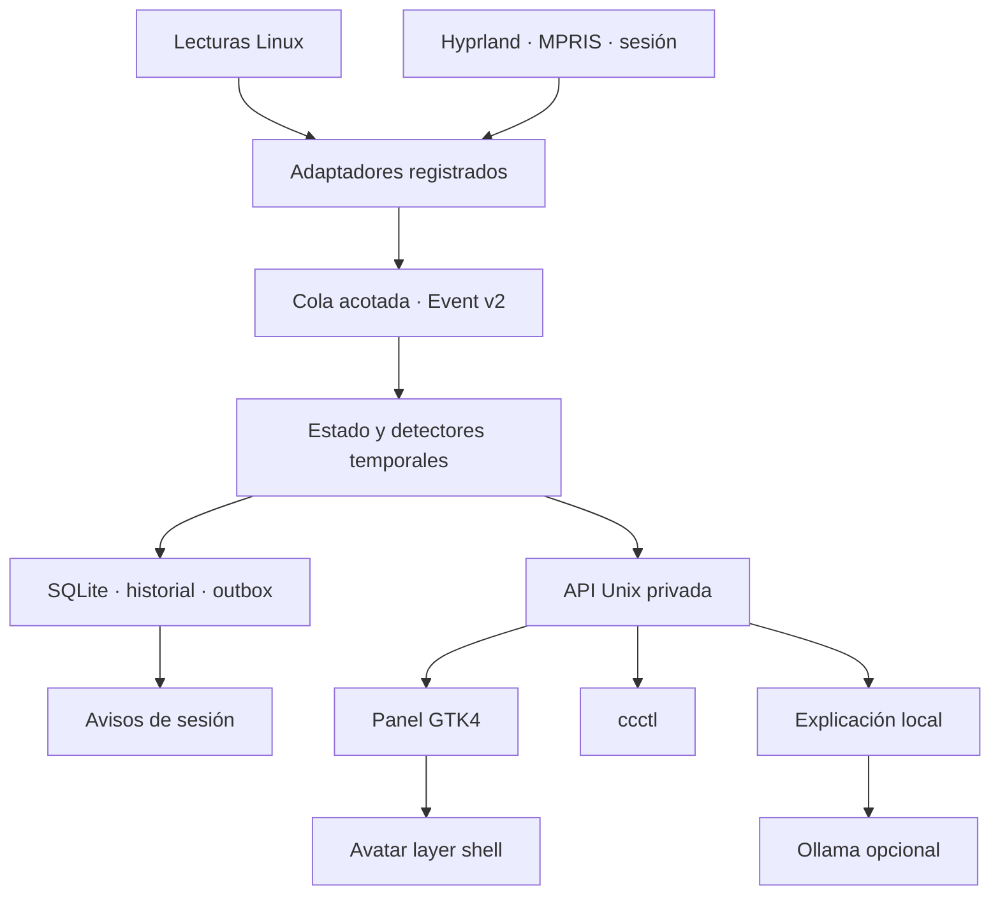

# Estado de implementación — Wisp 0.14

Fecha: 2026-09-07. Primera entrega funcional posterior a la revisión v0.13.1.
La base de esta rama es `ec5ed939` (PR #5), que a su vez incluye la pila de PRs
anteriores. Esta entrega reúne contratos, servicio y cliente en commits
separados para revisar una funcionalidad completa.

## Arquitectura que ya ejecuta

El servicio es el único dueño del estado y la persistencia. El cliente gráfico
no lee `/proc`, no interpreta ventanas, no aplica detectores y no dirige el
servicio por señales del renderer. Una avería o cierre de GTK no detiene los
sensores. El atlas conserva los siete estados visuales anteriores mediante una
máquina de animación local a la vista.

| Límite | Implementación |
|---|---|
| Entrada de hechos | Solo manejadores de sensores registrados dentro del proceso; la API no permite publicar hechos |
| Contratos | Event v2, JSON inmutable en profundidad, valores finitos, campos cerrados por dominio |
| Orden | Un consumidor, secuencia global reservada en SQLite en bloques de 1024; generación por proceso |
| Frescura | Reloj monotónico, leases por fuente, reinicio sin restaurar muestras, invalidación tras pausa |
| Estado desconocido | La desaparición de una fuente, montaje o sensor no confirma recuperación |
| Detectores | Dwell, histéresis, incidente estable, evidencia inicial y última evidencia separadas |
| Persistencia | Escritor SQLite serializado, WAL, `synchronous=FULL`, versión de esquema; estado y outbox en una transacción |
| Fallo de persistencia | Estado de salud degradado; preferencias rechazadas; observación en memoria; IA vuelve a reglas locales |
| Atención | Dedupe por incidente, reemplazo de aviso, silencio, revisión, posposición y estado de sesión |
| Transporte | Socket 0600 en directorio 0700, `SO_PEERCRED`, misma UID, 8 conexiones, frame 64 KiB, JSON estricto |
| Bloqueo de tareas | Subprocesos con argumentos separados, plazo, salida limitada y recolección; una lectura nativa pendiente por sensor |
| Interfaz | Peticiones en workers, repintado en GTK, reconexión, dato ausente visible, respuesta tardía descartable |
| IA | Una consulta explícita, endpoint loopback fijo, contexto con lista de campos permitidos, sin herramientas ni historial |

Las observaciones se registran cada 2 s (sistema/escritorio/sesión), 5 s
(red/media), 30 s (almacenamiento) o 10 s (VM opcional). Los reintentos fallidos
retroceden hasta 30 s. La cola tiene 64 entradas y ejerce contrapresión sobre
los productores; esta versión no implementa coalescing por clave. Los clientes
consultan estado cada 1.5 s; no hay todavía streaming `state.subscribe`.

La base guarda hasta 24 incidentes, 30 entradas de actividad visibles y 2000
registros de auditoría. La outbox conserva como máximo 256 entregas recientes.
No guarda muestras crudas, ventanas, música ni chat.
Los datos operativos se checkpointan cada 5 s; las transiciones y preferencias
se guardan antes de producir efectos durables. Un fallo de disco puede perder
actividad en memoria; no se promete replay completo de eventos. La outbox se
entrega con deduplicación de presentación cuando es posible, sin prometer
exactamente una notificación ni que el usuario la haya visto.

## Relación con la arquitectura objetivo

La arquitectura v0.13.1 sigue siendo el objetivo; esta versión reduce el alcance
de implementación de forma explícita:

- La API ofrece `hello`, estado, salud, incidentes, explicación, preferencias,
  atención, consulta local y apagado del propio daemon. Es una versión acotada
  `cc.ipc/1`, no toda la API aspiracional de la revisión.
- No se agregan acciones de OS. Por eso no se simulan registros de capacidades,
  aprobaciones o ejecución. Deben implementarse antes de admitir efectos fuera
  del estado propio de Wisp.
- El puente v1 tiene validación corregida; el nuevo servicio usa observaciones
  v2 nativas. El runtime v0.11 queda disponible como implementación anterior y
  no se inicia junto con el nuevo avatar.
- Los adaptadores de escritorio consultan herramientas existentes. Eventos
  nativos de Hyprland/D-Bus y aislamiento en procesos de lecturas potencialmente
  bloqueantes siguen siendo mejoras pendientes.
- La configuración y SQLite tienen versión; por ahora solo se acepta esquema 1.
  No hay una cadena de migraciones de formatos todavía inexistentes.
- Ollama es un adaptador opcional. No hay proveedor de nube, SDK de OpenAI ni
  acciones propuestas por modelos en esta entrega.

## Cómo extender sin acoplar

1. Añade una observación pequeña y tipada en `core/model.py`, con política de
   ausencia y lease. Mantén el presupuesto total de la respuesta IPC.
2. Implementa el adaptador de lectura en `sensors.py` o un módulo específico;
   regístralo en configuración y en el catálogo del daemon. No importes GTK,
   proveedores de IA ni notificaciones desde el adaptador.
3. Añade el detector puro y sus pruebas con reloj inyectable. Especifica entrada,
   recuperación, duración, identidad y comportamiento al perder la fuente.
4. Añade solo la presentación necesaria. Los widgets consumen el snapshot y
   envían intenciones por la API; nunca convierten animaciones en hechos.
5. Para un nuevo proveedor de IA, conserva la lista de campos de contexto y el
   fallback. Un proveedor remoto necesita un contrato de consentimiento,
   credenciales y egreso antes de configurarlo como disponible.
6. Antes de introducir una acción de OS, implementa los límites descritos en
   `CAPABILITIES_SECURITY_AND_ACTIONS.md` y sus pruebas de autorización.

## Puertas de aceptación

Se deben ejecutar `unittest`, `smoke-desktop.py` y `smoke-ui.py`. La última usa
GTK real; no sustituye la aplicación por HTML. La prueba de socket marca una
omisión cuando AF_UNIX está prohibido; el smoke del daemon es una puerta estricta
que debe ejecutarse en Linux con ese transporte disponible.

Después: aceptación de sesión en Gentoo/Hyprland y medición de CPU/RSS durante
al menos una sesión de trabajo, incluyendo renderer oculto, reposo, medios y
reconexiones. No se consideran verificadas aquí la integración Wayland real ni
la inferencia de un modelo instalado.

Fuentes de los límites de integración: [GTK DrawingArea](https://docs.gtk.org/gtk4/class.DrawingArea.html),
[ejemplo oficial de precarga de gtk4-layer-shell](https://github.com/wmww/gtk4-layer-shell/blob/main/examples/simple-example.py),
[IPC de Hyprland](https://wiki.hypr.land/IPC/) y
[API de Ollama](https://docs.ollama.com/api/chat).
