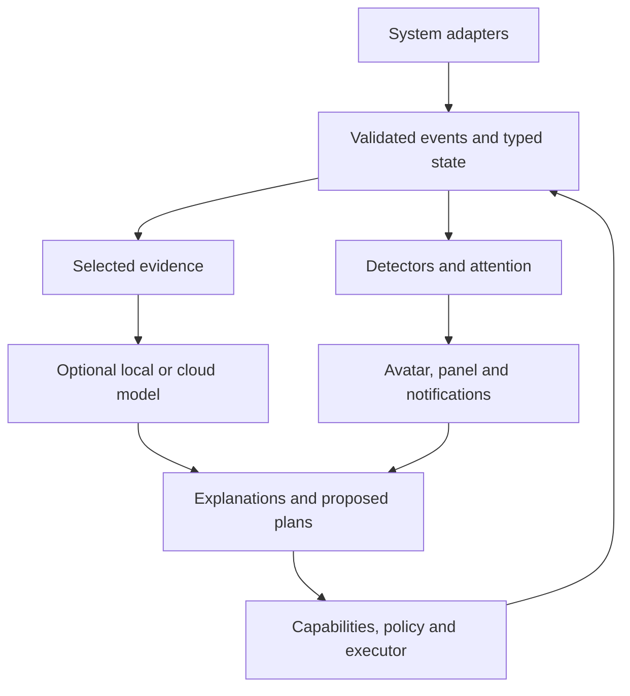

# Runtime integration contract

Status: **proposed v0.13.1 clarification**. Date: **2026-09-07**.
This document resolves ambiguities in the v0.13 target; it is not implemented.
For conflicting details, this clarification takes precedence over the initial
v0.13 prose. Envelope/payload changes still need a separately reviewed code PR.

## 1. One owner and explicit boundaries

One unprivileged `cyber-companiond` owns state, event ordering, insights and
action policy for the current user/session. The CLI, native panel, avatar and
model server are independent clients/processes. GTK/Wayland and model SDKs are
optional dependencies outside the core import path.

Observation adapters receive an ingress handle scoped to their registered
component instance. The core supplies authoritative source, observed time and
classification floors; untrusted input cannot claim a different sensor identity,
lower privacy or allocate sequence numbers. Plugins are explicitly enabled.
Installed entry points are discovery only, never permission to load code.

## 2. Complete the ingress contract before runtime migration

Use the existing v2 envelope shape as the starting point. Complete these rules:

- Required strings are type-checked, nonempty and length-bounded.
- Sequence and non-null TTL are positive integers, excluding Python booleans.
- All enum values are validated on construction/deserialization.
- Timestamps are parsed and canonicalized to UTC; core observation time cannot
  come from the producer. Historical occurrence time is evidence, not ordering.
- Payloads accept bounded JSON values only: no NaN/infinity, objects with custom
  behavior, non-string keys, excessive nesting or unbounded strings/lists.
- Schema validation establishes required fields, ranges, units and semantic
  consistency. A CPU ratio is a finite number in [0,1], not a percentage string.
- Canonical payloads are recursively immutable; serialization returns detached
  JSON values. Mutating any source dictionary/list cannot change accepted facts.
- The schema registry owns source permissions, privacy floors, retention and
  delivery rules. Unknown schemas/identities produce bounded diagnostic metadata;
  rejection logs must not copy arbitrary rejected payloads.

Use one ordered privacy vocabulary: `public < local_private < sensitive < secret`.
Remove the ambiguous proposed `local` label before v2 runtime adoption. Migrate
legacy `local` conservatively to `local_private`; reject unknown labels. `secret`
is a rejection/redaction marker and cannot be admitted into events or prompts.
Field-level classifications can only raise the envelope/context classification.
These are project labels, not a claim of an external compliance standard.

The v1 bridge must cover adapter exceptions from the controller, configured
instance names, media reconciliation/disconnects and Linux threshold transitions.
Health events preserve error category and component state; mapping three failure
names into one undifferentiated dictionary is insufficient. Exception strings
and media metadata are sensitive, untrusted text with bounded/redacted output.

## 3. Ordering, queues and threshold events

Allocate a global accepted sequence in the single reducer owner, after validation
and queue admission. Selection across delivery classes occurs before allocation;
once allocated, reduction cannot overtake an earlier event. Gaps are allowed.
Persist a high-water reservation in small blocks (initial proposal: 1,024 IDs)
before using it, so a restart never reuses a previously allocated sequence even
when ephemeral telemetry was not journaled. A database reset changes the store
identity; IDs/cursors from the previous store are invalid.

Initial, configurable bounds:

| Resource | Initial design limit | When full or slow |
|---|---|---|
| Accepted event | 64 KiB encoded, nesting depth 16 | Reject; emit bounded error metadata |
| Pending latest values | 256 registered source/subject/schema keys | Replace same key; reject unexpected cardinality |
| Ordered ingress | 512 events | Bounded producer backpressure; explicit retryable failure |
| Critical/audit ingress | 128 reserved events | No silent discard; reject acknowledgement and mark degraded |
| Optional consumer | 64 messages, with byte limit | Coalesce projections or disconnect and require resync |
| Blocking worker pool | 4 concurrent jobs, queue 16 | Report busy; deadline applies while queued |

Numbers are starting budgets for measurement, not benchmark results. Fair
scheduling prevents telemetry starvation; sustained overload raises health and
freshness issues instead of pretending full coverage. Critical does not imply
infinite buffering or guaranteed delivery during a storage failure.

Thermal entry/clear and sensor-availability transitions are distinct ordered or
critical facts, emitted before replaceable samples can be coalesced. A small
source-side threshold latch, shared/tested independently, preserves these facts;
the domain detector decides the resulting insight and attention. Durable
transitions carry sensor identity, threshold/config version, dwell evidence and
source quality. Missing samples break continuous dwell; a delay or sensor loss
cannot establish recovery. A transient between physical samples is unobserved,
not a promised detection.

## 4. Persistence, replay and disk failure

SQLite WAL uses a dedicated single writer outside the event-loop thread, bounded
requests, explicit migrations and durability settings. Durable acknowledgement
requires a successful transaction (`synchronous=FULL` for this first design).
The transaction commits accepted durable events, affected durable projections,
reducer checkpoints, insight transitions and pending delivery records together.
Reducers compute without I/O; their candidate state becomes authoritative only
after commit for a durable transition. Delivery workers read the committed
outbox and retry with stable delivery IDs.

Ephemeral samples remain in memory; write a bounded projection checkpoint at
most every five seconds, rather than journal every sample. Incident transitions
save the exact evidence needed to explain/replay that incident. Ordinary state
history cannot reconstruct every discarded sample. Replay has two explicit
levels:

1. Recorded raw scenario fixtures reproduce detector behavior deterministically.
2. The retained operational journal reproduces durable outcomes/checkpoints;
   unavailable sample-by-sample history is reported as a gap.

Replay never re-executes OS actions or re-sends historical notifications. Outbox
delivery can be at-least-once: after a crash the desktop may have seen a message
whose acknowledgement was lost. Stable replacement IDs/deduplication reduce
duplicates; there is no exactly-once promise across SQLite and a desktop server.

On write failure, stop accepting side effects, approvals and cloud requests that
require durable audit. Surface `persistence_unavailable` via an independent
in-memory health/presentation path. Continue bounded live monitoring and read-only
status where possible; label it non-durable. If sequence reservation is exhausted,
do not fabricate accepted v2 IDs: show explicitly unjournaled live diagnostics.
Do not recursively try to journal a disk-full warning into the failed store.

Recovery opens and validates the store, reconciles fresh external state and
reports the observation gap. Do not invent missed facts. An invocation dispatched
before a crash with no certain result becomes `outcome_unknown` and is inspected,
not retried blindly. No side effect starts before its audit-start commit succeeds.

Initial retention budget: operational history 7 days, resolved incidents 30 days,
total store target 128 MiB including WAL (model files excluded). Pruning and WAL
checkpointing run in bounded work; pinned open incidents and unresolved actions
are protected. Warn at 80% budget; if pruning cannot make room, enter degraded
mode rather than deleting protected audit. Conversation retention is opt-in and
configured separately. Export consistent backups with SQLite's backup API;
copying only an active WAL database file is not a backup strategy.

## 5. Freshness, restart and lifecycle

Live freshness uses a core-owned monotonic clock. Suspend/resume invalidates live
sensor freshness and requests snapshots; UTC clock adjustments cannot extend
approval validity or sensor leases. On process restart, all persisted observations
are historical/stale until confirmed again, irrespective of wall-clock TTL.
Freshness is per field/source where needed: a media update cannot refresh CPU.
An event with no TTL does not grant an eternal lease to its derived state.

Expiry, cooldown and snooze evaluation uses an injected clock/scheduler. Durable
outcomes record the evaluation time/configuration; replay consumes those records
or a supplied scenario clock, never the replay machine's current time. This is
required for deterministic temporal detectors, not just pure payload reducers.

Capture source instance/generation so events from an old connection cannot
overwrite its replacement. Where a source cannot provide ordering, reconcile an
authoritative snapshot after reconnect and periodically. A reconnect announces an
observation gap; it does not infer every missed intermediate transition.

XDG ownership: config under `XDG_CONFIG_HOME`, durable state under `XDG_STATE_HOME`,
cache under `XDG_CACHE_HOME`, private sockets/locks under `XDG_RUNTIME_DIR`.
Directories are owner-only. Lock ownership prevents two daemons; never delete a
live socket merely because its path exists. Missing session/runtime prerequisites
produce a clear startup error. No hard dependency on a particular init system.

Foreground launch is the portable baseline. The installer later detects the
user's service manager/session and offers the matching user-session launcher.
It must not assume Gentoo uses systemd or enable both Hyprland autostart and a
second service. Optional adapter failure cannot stop the core. Renderer readiness
and process-generation ownership replace fixed sleeps/PID-only liveness checks.
Restarting the renderer resends the current semantic presentation snapshot.

## 6. System integration catalog

Intervals/leases below are proposed defaults; all sources can be disabled.

| Source | Boundary and cadence | Useful output | Missing/degraded behavior |
|---|---|---|---|
| CPU/memory/I/O | `/proc/stat`, `/proc/meminfo`, optional `/proc/pressure/*`; 2 s sample, 6 s lease | Distinguish productive load from sustained contention | Missing PSI is unavailable, not zero pressure |
| Thermal | Named hwmon sensors and available limits; 2 s sample | Per-sensor warning and recovery with hysteresis | Missing sensor means unknown; never apply one CPU limit to every sensor |
| Storage | `statvfs` on configured local mounts; 30 s, 90 s lease | Available bytes, fraction and inode pressure | One stalled mount times out in a bounded worker; no recursive directory scan |
| Network | Link/route snapshots and change subscription where supported | Link, route, DNS and reachability reported separately | A route alone never proves Internet access; active DNS/HTTPS probes are configured/on-demand and declare network use |
| MPRIS | Existing playerctl follower plus 5 s reconciliation initially | Media state and exact player identity for later actions | Distinguish empty inventory from failed query; successful unchanged snapshot refreshes lease |
| Hyprland | Documented IPC events plus snapshots at connect/reconnect | Outputs, workspace IDs, fullscreen/session context | Compositor restart invalidates desktop data; omit titles/content by default |
| Session | Available logind/elogind signals or configured locker integration | Lock, idle and resume observations | Unknown lock state hides sensitive automatic UI; explicit client opening must establish presence |
| libvirt | Read-only connection, lifecycle subscription plus reconciliation | Domain UUID/state, expected versus observed transition | Permission failure disables this adapter; no background escalation or VM XML edits |

The Linux PSI interface measures time stalled on CPU, memory and I/O; it is
additional evidence of contention, not the CPU utilization percentage.
[Kernel PSI documentation](https://docs.kernel.org/accounting/psi.html).
libvirt exposes a read-only connection entry point; use it for observation and
keep future mutations behind a separate capability.
[libvirt host API](https://libvirt.org/html/libvirt-libvirt-host.html#virConnectOpenReadOnly).

Future PipeWire integration may expose output mute/device state, then optional
audio energy for music animation. It must have independent cadence/backpressure;
microphone capture and raw audio retention are outside this generation.

## 7. Local IPC and interaction

The proposed control protocol is newline-framed UTF-8 JSON RPC (`cc.ipc/1`) over
the owner-only Unix socket. This is a project protocol, not a claim of JSON-RPC
2.0 compliance. One initial `hello` negotiates major version and capabilities.
Each request has `id`, `method` and schema-validated `params`; each response
correlates `id`, `result` or a bounded structured `error`.

Initial limits: 64 KiB/frame, 16 outstanding requests/client, 8 clients and a
5 s frame-read deadline. Reject unknown methods and trailing malformed frames.
Check Linux peer credentials against the socket owner. Same-UID access is a
desktop trust boundary, not protection against arbitrary compromised same-user
processes; a client-declared name is never proof that the human approved an action.

Initial methods: `status.get`, `health.get`, `insights.list`, `insight.get`,
`insight.acknowledge`, `insight.snooze`, `attention.mute`, `state.subscribe`.
Preferences/actions have distinct methods and are policy-checked by the core.
Later methods add `assistant.ask`, cancellation and exact plan approval; clients
must discover availability and never show an enabled control for an absent method.

Subscriptions first return an atomic snapshot and cursor `(store_id, generation,
revision)`, then ordered projection deltas. A queue gap, reconnect or incompatible
cursor requires a new snapshot. Do not use event sequence gaps alone to infer
subscription loss: coalescing and sequence reservations legitimately create gaps.
Large histories are paginated; slow consumers cannot pin unbounded state.

Direct user gestures such as mute/snooze are exact, reversible preference
commands and need no duplicate confirmation. Background/model proposals do not
inherit that permission. Stateful VM actions show exact UUID, consequence and
fresh preconditions before approval. Resolve `active player` or a display name
to stable identity before signing approval, then revalidate before execution.

## 8. AI resource and egress constraints

Start with one local explanation request at a time, bounded context/output and a
cancel button. A busy/overheated host delays background explanations; deterministic
alerts remain active. Inference load must not trigger a loop of new AI analyses
of its own CPU alerts. No automatic explanations on every telemetry event.

Select the model only after measuring available VRAM/RAM, cold/warm latency and
desktop responsiveness alongside the user's normal workloads. The design does
not promise a model size or speed based solely on the GPU product name.
Keep model downloads outside the repository and outside the daemon's runtime.

For Ollama, loopback location alone is insufficient to establish local-only
inference: explicitly disable cloud features and select installed local models.
The project will test `OLLAMA_NO_CLOUD=1` on its pinned server version, bypass
proxies for local calls, forbid redirects to remote providers and verify model
egress in integration tests. Network diagnostics are separately classified.
[Ollama local/cloud controls](https://docs.ollama.com/faq).

OpenAI remains an optional Responses adapter. `store:false` avoids using stored
response objects as conversation ownership; it is not a universal guarantee of
zero provider retention. Evaluate endpoint/model data controls before enabling
egress; pass only the disclosed, minimized evidence bundle.
[OpenAI data controls](https://developers.openai.com/api/docs/guides/your-data).

## 9. Required failure demonstrations

Before enabling Core v2: test mutation attempts and malformed input; queue floods
and stale generations; sensor disappearance during warning; suspend/restart and
clock jumps; disk-full and interrupted transactions; duplicate/lost outbox acks;
slow/disconnected UI; renderer death; provider hang and unexpected egress.
Each test asserts an observable result, not a mirror of helper implementation.

Targets to measure: p95 accepted critical event to local presentation broker
under 250 ms, status query under 200 ms, core idle CPU under 1% of one logical
CPU and RSS under 100 MiB. Exclude external sampling delay, desktop-server policy,
animation and inference; report them separately. These are acceptance objectives,
not performance already achieved by this repository.
