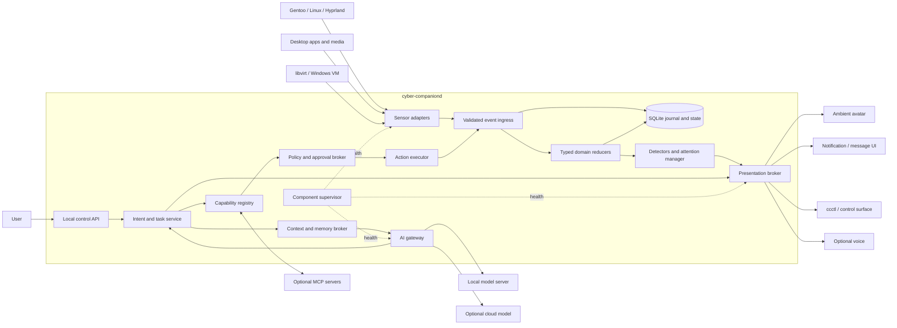

# Target Architecture

Status: **proposed for v0.13 implementation**

## 1. Architectural style

Cyber Companion will be a **local-first modular monolith**. One user daemon owns
ordering, state, policy and audit. External processes are used only where they
provide a real isolation or lifecycle benefit: the avatar renderer, local model
server, optional plugin workers and remote services.

This is deliberately not a microservice architecture. A single-user desktop
assistant does not benefit from Redis, Kafka, NATS, Kubernetes or a collection
of always-on network services. Strong module boundaries, typed contracts and
selective process isolation provide the needed extensibility without creating
an operations project inside the desktop project.

The implementation should use an asynchronous core with bounded queues.
Blocking library calls and long-running external commands must execute outside
the reducer lane. The exact Python framework is an implementation detail; the
contracts in this document are not.

## 2. System context



## 3. Dependency rule

Dependencies always point inward toward contracts and domain semantics.
Infrastructure modules implement ports; application and domain modules never
import infrastructure SDKs.

```text
interfaces / adapters / providers / renderers / storage
                        |
                        v
          application services and ports
                        |
                        v
              domain types and rules
```

Forbidden dependency examples:

- a Linux adapter importing a renderer;
- a reducer importing OpenAI, Ollama or MCP code;
- a model provider calling an action implementation;
- an avatar renderer reading `/proc`, MPRIS or SQLite directly;
- an executor interpreting free-form shell text from a model;
- a notification backend choosing product priority;
- a capability implementation granting its own permission.

## 4. Runtime components

### 4.1 Component supervisor

The supervisor owns lifecycle, not product decisions. Every runnable component
reports one of:

```text
starting -> healthy -> degraded -> backoff -> healthy
                    \-> failed
                    \-> stopped
```

It provides:

- startup dependency ordering;
- cancellable tasks and graceful shutdown;
- heartbeat/readiness status;
- bounded restart with exponential backoff and jitter;
- circuit breaking for repeatedly failing providers;
- per-component health surfaced through state and diagnostics;
- isolation so an optional component cannot terminate the daemon.

A component failure becomes an operational event, but publishing that event
must not recursively restart the same component without backoff.

### 4.2 Sensor adapters

Sensors observe external systems and emit normalized facts. They are read-only
by contract. Initial adapters should include:

- Linux CPU, memory, temperature, load and storage;
- MPRIS playback and metadata;
- Hyprland session, focused workspace and monitor metadata through documented
  IPC, without screen capture;
- network link, route, DNS/connectivity and recovery state;
- libvirt VM lifecycle;
- session lock/unlock, idle and shutdown intent where available.

An adapter may maintain local sampling state and hysteresis needed to transform
raw data into facts, but it does not choose user priority, messages or actions.

### 4.3 Event ingress and backbone

Ingress validates event schema and metadata, assigns the core sequence,
normalizes observation time, applies deduplication and routes the event by
retention/delivery class.

The event backbone has separate concerns:

- one strictly ordered lane for typed reducers;
- independent bounded queues for projections, attention and outputs;
- latest-value coalescing for replaceable telemetry;
- durable journal before acknowledgement for audit/action events;
- explicit overflow behavior; no unbounded queues;
- subscriber exceptions captured and isolated.

No subscriber callback runs while a global publish lock is held.

### 4.4 Journal and projections

SQLite in WAL mode is the default local store. It contains logically separate
schemas/tables for:

- durable events and retention metadata;
- current domain snapshots;
- component health;
- insight lifecycle and deduplication keys;
- conversation threads and explicit memories;
- action plans, approvals, executions and audit;
- schema/database migration history.

High-rate raw telemetry is not automatically permanent. It is coalesced or
sampled according to its retention class. Critical transitions and action audit
records are durable.

A human-readable JSON snapshot may be exported atomically for debugging, but it
is a view, not authoritative state.

### 4.5 Typed domain reducers

A reducer owns one aggregate and accepts only registered event schemas. Initial
domains include:

```text
system, storage, network, media, session, desktop, virtualization,
components, interaction, assistant, actions
```

Reducers are deterministic and side-effect free. Given a prior snapshot and an
ordered event, they produce a new snapshot and optional domain-transition facts.
Snapshots carry freshness and provenance. A model response cannot mutate a
domain snapshot.

### 4.6 Insight detectors

Detectors transform domain state and transitions into `InsightCandidate`
objects. They are deterministic by default. Examples:

- CPU saturation sustained beyond a dwell time;
- thermal threshold entered or recovered;
- disk free space crossed a threshold;
- network connectivity lost or restored;
- VM failed to reach its expected state;
- an adapter or model provider entered a repeated failure state.

A detector states evidence, severity, confidence, deduplication key, expiry and
suggested read-only enrichment capabilities. It does not notify directly.

### 4.7 Attention manager

The attention manager decides whether, when and through which channels an
insight should reach the user. It applies:

- severity and urgency;
- deduplication and cooldown;
- quiet hours and focus/session context;
- per-category interruption budgets;
- acknowledgement, snooze and resolution state;
- correlation of symptoms into one incident;
- escalation when a condition persists or worsens.

Critical safety/availability conditions remain deterministic. AI may improve an
explanation but cannot suppress or downgrade the underlying alert.

### 4.8 Intent and task service

All user requests and proactive follow-ups become typed intents. Examples:

```text
companion.status
insight.explain
system.diagnose
network.diagnose
media.control
vm.inspect
plan.approve
plan.cancel
assistant.ask
```

The task service decides what context and capabilities are required. It may use
a deterministic workflow, a model-generated proposed plan, or both. It owns the
task state machine and never executes side effects directly.

### 4.9 Capability registry

The registry is the only catalog of operations available to application logic
or models. Capabilities are typed as `sensor`, `query` or `action` and publish a
versioned descriptor containing input/output schemas, risk and operational
properties.

Native implementations and MCP-imported tools are normalized behind the same
capability contract. Discovery never implies permission.

### 4.10 Policy and approval broker

The broker evaluates every action request against local policy, current user
presence, data classification, requested arguments and capability risk. Its
output is one of:

```text
allow | require_approval | deny
```

The decision is deterministic, recorded and independent of the model that
proposed the action. Approvals are scoped to the exact plan/capability/arguments
and expire; they are not broad conversational consent.

### 4.11 Action executor

Only the executor may invoke an action capability. It provides:

- input and output schema validation;
- timeout and cancellation;
- idempotency keys and duplicate suppression;
- precondition revalidation after approval;
- stdout/stderr/result size limits and redaction;
- rollback metadata where a capability is reversible;
- a complete correlated audit lifecycle;
- action-result facts returned to ingress.

The first generations must not expose a generic shell capability. Explicit,
narrow operations are safer, easier to test and more useful to the model.

### 4.12 AI gateway

The AI gateway implements provider selection, health, budgets and request
normalization. It exposes application tasks such as explanation, summarization,
intent interpretation and proposed-plan generation, not raw provider endpoints.

Providers run off the critical event path. Requests are cancellable, bounded by
time and output size, and receive a minimal `ContextBundle` assembled by the
context broker. The domain core does not store provider-native conversation
objects as its source of truth.

### 4.13 Context and memory broker

The broker is the sole path from local state/memory into a model request. It:

- selects only fields relevant to the task;
- applies privacy labels and redaction;
- removes secrets and excessive raw telemetry;
- enforces token/context, latency and cost budgets;
- records what categories were disclosed and to which provider;
- retrieves explicit memories and a bounded conversation window;
- creates a provider-neutral context package.

Memory is separated into operational state, retained events, explicit user
preferences, conversation history and optional semantic memory. No model may
write long-term memory directly.

### 4.14 Presentation broker

Presentation is multi-channel. A semantic request can fan out to:

- ambient avatar state;
- concise desktop message/notification;
- local control UI or CLI output;
- optional audio/TTS;
- progress and approval surfaces.

The broker applies channel availability, user preferences and severity. The
avatar is allowed to be playful; critical details and confirmation choices must
also appear in a textual, inspectable channel.

Wayland V-Pets remains a compatibility adapter for ambient states. A richer
layer-shell renderer may replace it later without changing insights, tasks,
plans or policy.

### 4.15 Local control API

`cyber-companiond` exposes a versioned Unix-domain socket under:

```text
$XDG_RUNTIME_DIR/cyber-companion/control.sock
```

The socket is owner-only (`0600`) and validates local peer identity where the
platform supports it. No TCP listener is enabled by default.

Initial clients:

- `ccctl` for status, health, insights, ask, explain, mute, approve and cancel;
- a lightweight notification/action bridge;
- future command palette, tray/control panel or clickable avatar UI.

Hyprland key bindings can launch a client; the daemon does not need global input
capture.

## 5. Proposed package boundaries

This is a target layout, not an instruction to move every file in one commit.

```text
cyber_companion/
  domain/
    events.py
    state.py
    insights.py
    intents.py
    capabilities.py
    actions.py
    presentation.py
  application/
    ingest.py
    reducers.py
    attention.py
    tasks.py
    planning.py
    policy.py
    execution.py
    context.py
  ports/
    event_store.py
    state_store.py
    model_provider.py
    capability.py
    renderer.py
    notifier.py
    secrets.py
  infrastructure/
    sqlite/
    ipc/
    logging/
  adapters/
    linux_system/
    mpris/
    hyprland/
    network/
    libvirt/
    session/
  providers/
    ai/
      ollama.py
      llama_cpp.py
      openai.py
    mcp/
  capabilities/
    system_queries/
    network_queries/
    media_actions/
    vm_actions/
  renderers/
    wayland_vpets/
    notifications/
    terminal/
  runtime/
    supervisor.py
    composition.py
```

The package names may change during implementation, but dependency direction
and contracts may not be weakened for convenience.

## 6. Plugin model

Every extensible component declares a manifest before instantiation:

```json
{
  "api_version": "cc.component/v1",
  "id": "adapter.linux_system",
  "kind": "adapter",
  "version": "1.0.0",
  "config_schema": "cc.adapter.linux_system.config@1",
  "emits": ["cc.system.telemetry@2"],
  "permissions": ["proc.read", "sysfs.hwmon.read"],
  "isolation": "in_process"
}
```

Built-ins may register through Python entry points or an explicit built-in
registry. External plugins use a supervised stdio protocol and must not be
loaded as arbitrary Python into the daemon by default. Component API versions
are independent from application release versions.

## 7. Reliability and performance rules

- The deterministic observation-to-state-to-alert path never waits for AI.
- Reducers have one total core sequence and remain replayable.
- Every queue is bounded and publishes overflow metrics/events.
- Telemetry uses latest-value semantics when intermediate samples are obsolete.
- Transitions, approvals and audit events are not discarded.
- Renderer/provider outages degrade one channel, not the core.
- Provider calls have deadlines, concurrency limits and circuit breakers.
- Shutdown is graceful and leaves SQLite consistent.
- Startup reconstructs state from snapshots plus newer durable events.
- Schema and database migrations are explicit, monotonic and tested.

Initial architecture fitness target: a critical observed transition should
reach the attention/presentation broker locally within 250 ms at the 95th
percentile, excluding renderer animation latency. This target is measured after
the Core v2 slice rather than assumed.

## 8. Architecture fitness tests

The following scenarios become automated acceptance tests over time:

1. Disable all AI providers; deterministic monitoring and alerts still work.
2. Kill the renderer; state, insights, queries and audit continue working.
3. Block one subscriber; reducers and unrelated consumers continue processing.
4. Flood replaceable telemetry; memory stays bounded and the latest value wins.
5. Replay a durable event fixture; domain/insight output is deterministic.
6. Feed an expired state value; it cannot authorize or justify an action.
7. Return malformed model output; no action request reaches policy/execution.
8. Propose a destructive action; it is denied or requires exact approval.
9. Configure local-only mode; tests prove zero cloud egress.
10. Switch AI providers; no domain, plan or presentation contract changes.
11. Import an MCP tool; it receives the same policy and audit treatment as a
    native capability.
12. Restart during an action; idempotency and audit reveal the exact outcome.

## 9. Non-goals

The v0.13 platform design does not attempt to provide:

- distributed/multi-user orchestration;
- a cloud control plane;
- unrestricted autonomous administration;
- a general-purpose terminal agent;
- root-level remediation;
- always-on microphone or screen understanding;
- permanent storage of all raw telemetry;
- an LLM call for every event;
- a dependency on one renderer, one model or one MCP host.

These constraints are features: they keep the companion useful, inspectable and
safe enough to evolve continuously.
